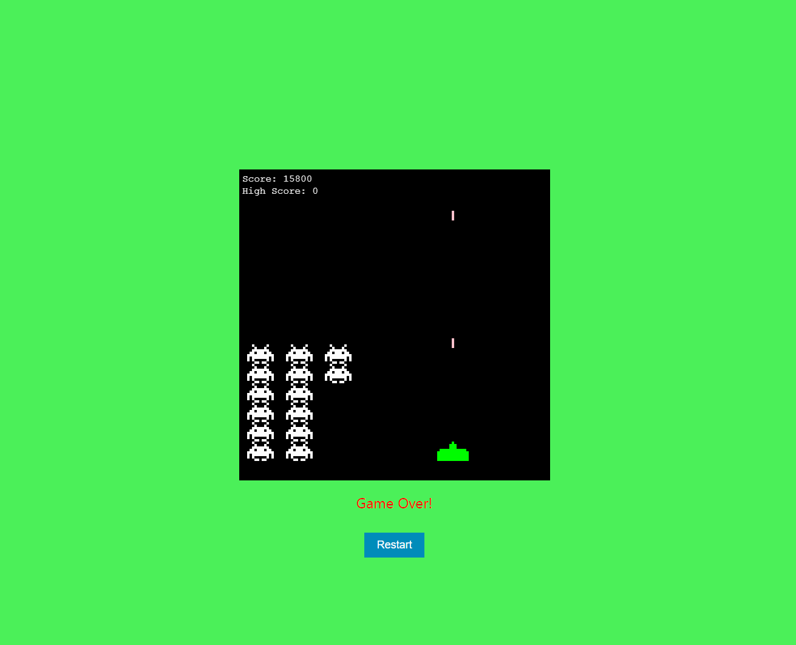

# Space Invaders Game

Space Invaders game that was created with HTML/CSS and JavaScript

### Play Space Invaders [here](https://kimdaby.github.io/Tic-Tac-Toe/)

## Summary

The Space Invaders game, developed using HTML, CSS, and JavaScript, provides a modern twist on a classic arcade experience. The game is built around the HTML5 canvas element, which serves as the dynamic rendering surface for the game's graphics. JavaScript plays a pivotal role, driving the game's mechanics and interactions. It manages complex game states using arrays to track multiple objects, including the player's ship, enemy invaders, and projectiles.

The core gameplay involves the player moving a spaceship horizontally at the bottom of the screen and firing at rows of aliens that move sideways and gradually descend. Successful hits on the aliens score points, with the goal being to eliminate all invaders before they reach the bottom of the screen. JavaScript event listeners are integral, responding to user inputs such as keyboard presses to control the ship's movement and firing actions.

CSS styles the canvas and user interface, ensuring the game is visually appealing and aligns with modern design standards. It adjusts the layout and aesthetic elements like colors, fonts, and buttons, enhancing the overall user experience.

Moreover, collision detection algorithms in JavaScript check for intersections between projectiles and aliens, updating the game state accordingly. This setup not only recreates the nostalgic feel of Space Invaders but also leverages contemporary web technologies to enhance performance and accessibility. This interactive project demonstrates the capabilities of web-based applications in recreating sophisticated, enjoyable gaming experiences.

## Author

David (Yun) Kim
